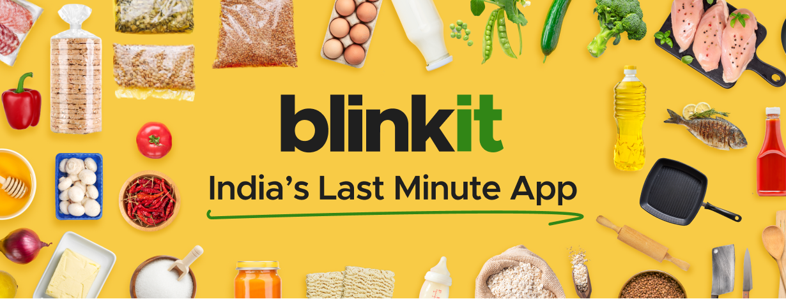

# 🛒 Blinkit Quick Commerce Backend 🚀

<p align="center">
  <!-- FIX: Re-path to the image so VS Code and GitHub can both find it from the root folder -->
  
</p>

<p align="center">
  
  
  
  
  
  
  
</p>

**"A beautiful backend is the heart of every great startup!"** 🫀💻

> _"We don't just deliver groceries in 10 minutes. We deliver high-availability, fault-tolerance, and highly scalable distributed systems."_ 🚀

Welcome to the **Ultimate Backend Engineering Journey!** I am building a highly scalable, real-world backend clone of **Blinkit** (10-minute grocery delivery) to completely master backend engineering.

<p align="center">
  
</p>

<h3 align="center">🤣 Literally my brain while learning to build this massive backend at 3 AM! 🤯🔥💻💀</h3>

---

## 🔥 Elite System Design Topics Covered

I am treating this project like a Tier 1 Silicon Valley startup. Here are the advanced engineering concepts I'm implementing:

- 🏎️ **Real-Time Data (WebSockets):** Live order tracking for Rider and Customer (Socket.io).
- 📍 **Geo-Spatial Querying (PostGIS / Elasticsearch):** Finding the nearest dark-stores in under `50ms` using Geo-hashing.
- 🔄 **Event-Driven Architecture (Kafka):** Decoupling services (Order Service -> Payment -> Inventory Update -> Rider Assignment).
- ⚡️ **Advanced Caching (Redis):** Lightning-fast product cart lookups, rate-limiting, and JWT token rotation.
- 📦 **ACID Transactions (PostgreSQL):** Concurrency control and locking to prevent double-selling limited groceries.
- ⚖️ **Horizontal Scaling & Load Balancing:** Containerized with Docker and ready for Kubernetes (K8s).
- 🛡️ **Hardened Security:** Helmet, payload validation (Zod), rate limiters, and DDoS protection algorithms.

---

## 🛣️ The Roadmap to Greatness

### 🟢 Phase 1: Foundation (v1-basics)

**Start small, build strong!** 🧱

- **Tech Stack:** Node.js, Express, TypeScript, PostgreSQL
- **Architecture:** MVC / Clean Folder Structure
- **Features:** User Auth, Product Catalog, Basic Cart
- **Goal:** Master REST APIs, robust error handling, and structured Typescript coding.

### 🟡 Phase 2: Core Logistics (v2-core)

**Make it operate like a 10-min delivery business!** 🏢

- **Authentication:** Advanced JWT & Role-Based Access Control (Admin, Delivery Rider, Customer) 🔐
- **Inventory Engine:** Pessimistic/Optimistic locking to secure limited products during checkout 🛒
- **Dark Store Logic:** Map user coordinates to valid delivery zones 🗺️
- **Payments:** Idempotent payment webhooks (Stripe / Razorpay clone) 💳

### 🔴 Phase 3: Extreme Scaling (v3-production)

**Handling massive 10,000+ Request/sec traffic!** 📈

- **Async Processing:** Push receipts & notifications to RabbitMQ / Kafka 📬
- **Read/Write Replicas:** Sharding the database for massive concurrent reads (users viewing products) 🗄️
- **Containerization:** Docker Compose setup for Local-to-Production parity 🐳
- **Observability:** Prometheus & Grafana dashboard integration 📊

---

### 🚀 Let's Build it!

Jump into `v1-basics/` to run the active phase:

```bash
cd v1-basics
npm install
npm run dev
```

---

<div align="center">
  <h3>⚡️ <b>"Pessimism in locking, optimism in caching, and absolute pragmatism in deployment."</b> ⚡️</h3>
  
  <p>
    
  </p>

  
  
  <i>Powered by Terminal 💻, fueled by Caffeine ☕, and built for immense Scale 🌐</i><br>
  <b>See you on the leaderboard!</b> 👑
</div>
